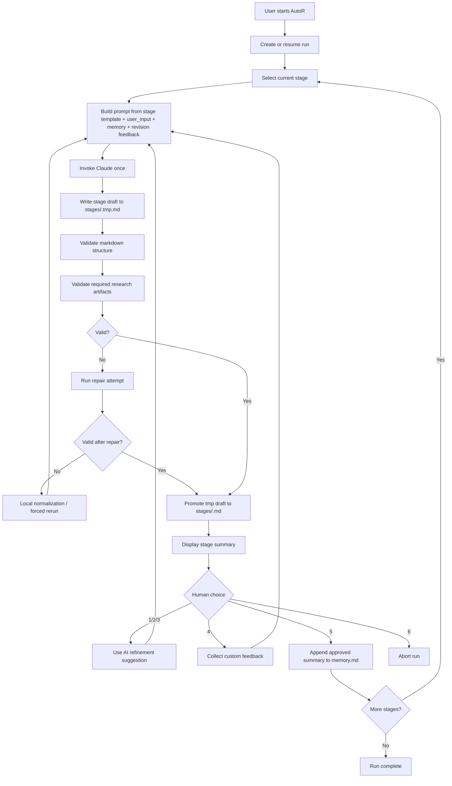
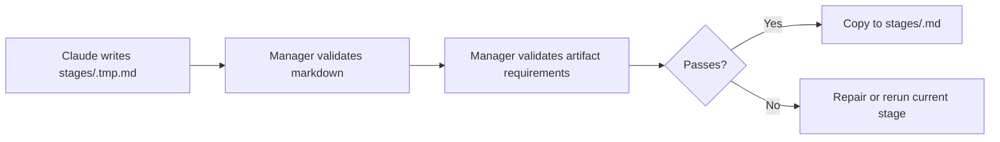
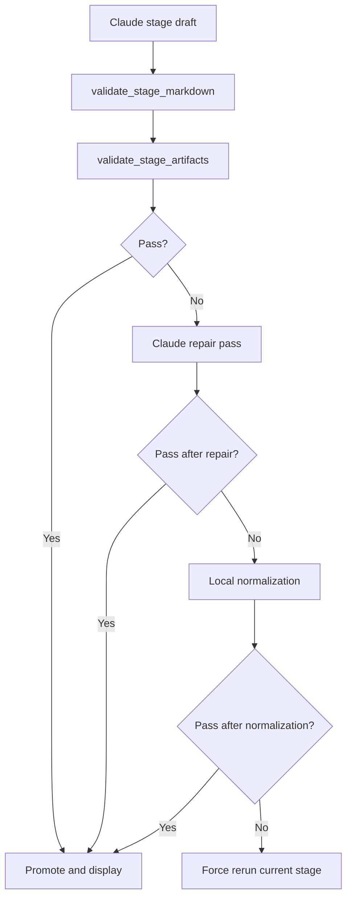

# AutoR

AutoR is a file-based research workflow runner for staged AI-assisted research. A user provides a research goal, AutoR executes a fixed 8-stage pipeline with Claude Code, and every stage must be explicitly reviewed and approved by a human before the workflow may continue.

The current system is terminal-first, but the terminal is only the present interaction surface. The workflow itself is designed around durable run directories, reproducible artifacts, and strict human approval gates.

## Overview

AutoR splits work into 8 fixed stages:

1. `01_literature_survey`
2. `02_hypothesis_generation`
3. `03_study_design`
4. `04_implementation`
5. `05_experimentation`
6. `06_analysis`
7. `07_writing`
8. `08_dissemination`

Each stage attempt:

- builds a prompt from the stage template, user goal, approved memory, and optional revision feedback
- invokes Claude Code exactly once
- writes a stage summary draft
- validates structure and artifact requirements
- promotes the validated draft to the final stage file
- pauses for explicit human approval

## Core Principles

- Stage order is fixed.
- `refine` means a full rerun of the current stage.
- Workflow state stays file-based and local to a run directory.
- Human approval is mandatory after every stage.
- Claude executes research work, but never controls workflow transitions.
- The stage summary file is not a scratchpad.
- Toy outputs are not acceptable once the workflow reaches data-, experiment-, analysis-, writing-, and dissemination-heavy stages.

## Architecture

### Main Modules

- [main.py](/mnt/d/xwh/ailab记录/工作/26年04月/AutoR/main.py)
  - CLI entry point
  - supports new runs and resuming existing runs
- [src/manager.py](/mnt/d/xwh/ailab记录/工作/26年04月/AutoR/src/manager.py)
  - owns the 8-stage loop
  - handles approvals, refinement, repair, promotion, and resume logic
- [src/operator.py](/mnt/d/xwh/ailab记录/工作/26年04月/AutoR/src/operator.py)
  - invokes Claude CLI
  - streams Claude output live to the terminal
  - handles repair prompts
- [src/utils.py](/mnt/d/xwh/ailab记录/工作/26年04月/AutoR/src/utils.py)
  - shared helpers for stage metadata, run paths, prompt construction, validation, and artifact checks
- [src/prompts/](/mnt/d/xwh/ailab记录/工作/26年04月/AutoR/src/prompts)
  - version-controlled stage prompt templates

### Dependency Direction

```text
main.py -> manager.py -> operator.py
                    \-> utils.py
operator.py -> utils.py
```

## Workflow Logic

### End-to-End Stage Loop



### Draft-to-Final Promotion

AutoR does not let Claude write directly to the final user-facing stage file.



This prevents half-finished stage summaries from contaminating the final stage record.

## Repository Layout

```text
repo/
├── README.md
├── main.py
├── src/
│   ├── __init__.py
│   ├── manager.py
│   ├── operator.py
│   ├── utils.py
│   └── prompts/
│       ├── 01_literature_survey.md
│       ├── 02_hypothesis_generation.md
│       ├── 03_study_design.md
│       ├── 04_implementation.md
│       ├── 05_experimentation.md
│       ├── 06_analysis.md
│       ├── 07_writing.md
│       └── 08_dissemination.md
└── runs/
```

## Run Layout

Every run is isolated under `runs/<run_id>/`.

```text
runs/<run_id>/
├── user_input.txt
├── memory.md
├── logs.txt
├── logs_raw.jsonl
├── prompt_cache/
│   ├── 01_literature_survey_attempt_01.prompt.md
│   ├── ...
├── stages/
│   ├── 01_literature_survey.tmp.md
│   ├── 01_literature_survey.md
│   ├── ...
├── workspace/
│   ├── literature/
│   ├── code/
│   ├── data/
│   ├── results/
│   ├── writing/
│   ├── figures/
│   ├── artifacts/
│   ├── notes/
│   └── reviews/
```

### File Roles

- `user_input.txt`
  - original user goal for the run
- `memory.md`
  - original goal + approved stage summaries only
- `logs.txt`
  - human-readable execution log
- `logs_raw.jsonl`
  - raw Claude `stream-json` output
- `prompt_cache/`
  - exact prompts used for each attempt and repair
- `stages/<stage>.tmp.md`
  - current attempt draft
- `stages/<stage>.md`
  - validated final stage summary
- `workspace/`
  - substantive research artifacts

### Workspace Boundaries

- `workspace/literature/`
  - papers, benchmark notes, survey tables, reading artifacts
- `workspace/code/`
  - scripts, implementations, configs, runnable pipeline code
- `workspace/data/`
  - dataset manifests, machine-readable metadata, processed splits, loaders
- `workspace/results/`
  - machine-readable outputs, metrics, tables, ablation data, evaluation artifacts
- `workspace/writing/`
  - manuscript sources, LaTeX, abstracts, sections, tables
- `workspace/figures/`
  - plots, diagrams, charts, visual assets
- `workspace/artifacts/`
  - compiled paper PDF, release bundles, packaged deliverables
- `workspace/notes/`
  - temporary notes, design notes, setup instructions, scratch material
- `workspace/reviews/`
  - critique notes, threat-to-validity notes, submission checklists, readiness reviews

## Prompt Construction

For every stage attempt, AutoR builds the prompt in a fixed order:

1. stage template from [src/prompts/](/mnt/d/xwh/ailab记录/工作/26年04月/AutoR/src/prompts)
2. required stage summary format
3. execution discipline and anti-placeholder rules
4. original user request from `user_input.txt`
5. approved context from `memory.md`
6. optional revision feedback

Prompt building is implemented in [src/utils.py](/mnt/d/xwh/ailab记录/工作/26年04月/AutoR/src/utils.py).

## Claude Invocation

AutoR currently uses Claude CLI in streaming mode. The operator writes the full prompt to `prompt_cache/` and then calls Claude using `@prompt-file` handoff to avoid shell argument limits.

The normal stage invocation shape is:

```bash
claude --model <model> \
  --permission-mode bypassPermissions \
  --dangerously-skip-permissions \
  -p @runs/<run_id>/prompt_cache/<stage>_attempt_<nn>.prompt.md \
  --output-format stream-json \
  --verbose
```

The operator implementation is in [src/operator.py](/mnt/d/xwh/ailab记录/工作/26年04月/AutoR/src/operator.py).

## Human Approval Loop

After a validated stage summary is displayed, AutoR waits for one of:

- `1`
  - rerun current stage with refinement suggestion 1
- `2`
  - rerun current stage with refinement suggestion 2
- `3`
  - rerun current stage with refinement suggestion 3
- `4`
  - rerun current stage with custom feedback
- `5`
  - approve stage and append approved summary to `memory.md`
- `6`
  - abort immediately

Only `5` advances to the next stage.

## Resume and Redo

AutoR can resume an existing run without creating a new run directory.

### Resume the latest run

```bash
python main.py --resume-run latest
```

### Resume a specific run

```bash
python main.py --resume-run 20260329_210252
```

### Redo from a specific stage inside the same run

```bash
python main.py --resume-run 20260329_210252 --redo-stage 03
```

Stage identifiers may be:

- `03`
- `3`
- `03_study_design`

Resume logic is implemented in [main.py](/mnt/d/xwh/ailab记录/工作/26年04月/AutoR/main.py) and [src/manager.py](/mnt/d/xwh/ailab记录/工作/26年04月/AutoR/src/manager.py).

## Validation Model

AutoR validates two things before a stage can be promoted:

### 1. Markdown Structure

Every stage summary must contain:

```md
# Stage X: <name>

## Objective
## Previously Approved Stage Summaries
## What I Did
## Key Results
## Files Produced
## Suggestions for Refinement
## Your Options
```

It must also:

- contain 3 numbered refinement suggestions
- contain the fixed 6 user options
- avoid placeholder markers such as `[In progress]`, `[Pending]`, `[TODO]`
- list concrete file paths in `Files Produced`

### 2. Artifact Requirements

Beyond markdown, later stages must produce concrete research artifacts:

- Stage 03+
  - machine-readable data artifacts under `workspace/data/`
- Stage 05+
  - machine-readable result artifacts under `workspace/results/`
- Stage 06+
  - figure files under `workspace/figures/`
- Stage 07+
  - NeurIPS-style LaTeX sources under `workspace/writing/`
  - compiled PDF under `workspace/writing/` or `workspace/artifacts/`
- Stage 08+
  - review/readiness artifacts under `workspace/reviews/`

Artifact validation is implemented in [src/utils.py](/mnt/d/xwh/ailab记录/工作/26年04月/AutoR/src/utils.py).

### Validation-to-Repair Flow



## Current Acceptance Standard

A run is not considered serious or submission-aligned if it only contains prose artifacts. In particular:

- `workspace/data/` cannot be markdown-only past study design
- `workspace/results/` cannot be markdown-only past experimentation
- `workspace/figures/` cannot be empty past analysis
- `workspace/reviews/` cannot be empty by dissemination
- `workspace/writing/` cannot stop at markdown-only drafts if the workflow reaches writing/dissemination

This is intentional. The current implementation is explicitly moving away from toy text-only outputs toward concrete research packages.

## CLI

### Start a new run

```bash
python main.py
```

### Start a new run with a goal provided inline

```bash
python main.py --goal "Your research goal here"
```

### Fake operator mode

```bash
python main.py --fake-operator --goal "Smoke test"
```

## Scope

### Included

- fixed 8-stage workflow
- one Claude invocation per stage attempt
- mandatory human approval after every stage
- AI refine / custom refine / approve / abort
- isolated run directories
- streaming Claude output
- repair passes
- draft-to-final stage promotion
- resume and redo-stage support
- artifact-level validation gates

### Out of Scope

- multi-agent orchestration
- database-backed state
- web UI
- concurrent stage execution
- automatic reviewer scoring

## Notes

- `runs/` is gitignored.
- The repo currently provides workflow control, validation, and prompt structure.
- Whether a given run produces a real submission-grade package still depends on the available environment, data access, model access, and the quality of the stage attempts themselves.
